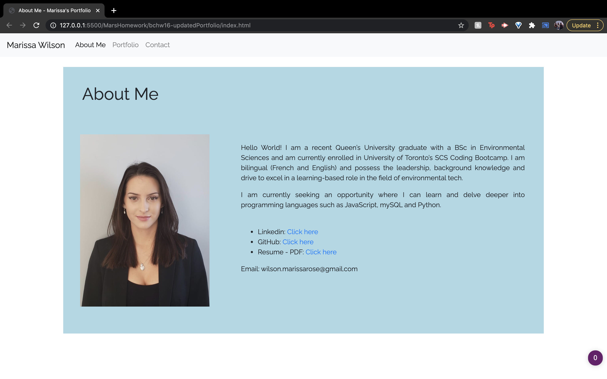
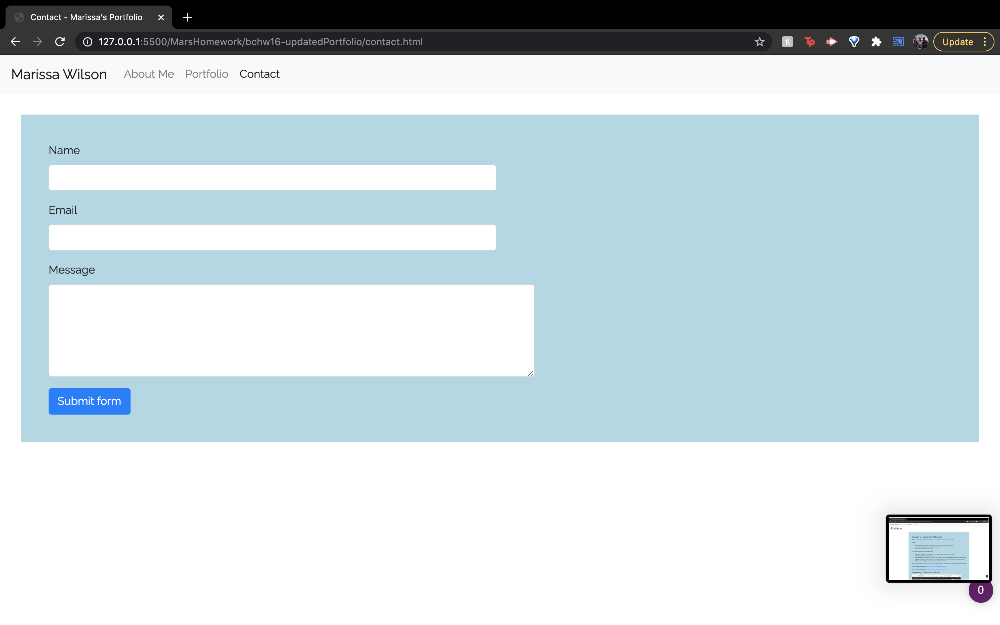

# Marissa's React Portfolio

## 📖 Table of Contents

* [Description](#description)
* [Usage](#usage)
* [Screenshots](#screenshots)
* [Credits](#credits)
* [Questions](#questions)
* [License](#license)

## 🔎 Description

This is my personal portfolio made with react, which includes links to my Linkedin, github projects and repositories and resume.
In the updated portfolio, I updated my pinned repositories on Github to include screenshots in the READMEs, added examples of the work I've done in the portfolio tab, and added some CSS styling to all of the pages so that they had the same color scheme.

Link to deployed application: [https://marissarrwilson.github.io/bchw20-reactPortfolio/](https://marissarrwilson.github.io/bchw20-reactPortfolio/)

## 💡 Usage

The user can navigate the site using the tabs on the navbar - "About Me", "Portfolio" and "Contact".

## 📸 Screenshots

* Home

* Portfolio

* Contact

## 🧠 Credits

Individual work by me, Marissa Wilson, with the help of...
* Instructors Fil and Daniel
* The Boolean Bros

## ❓ Questions

For any questions regarding this project, I can be reached at wilson.marissarose@gmail.com.

For additional information, please visit my GitHub profile here:
[GitHub](https://github.com/marissarrwilson)

## 🚗 License

- [License](https://choosealicense.com/licenses/mit/)